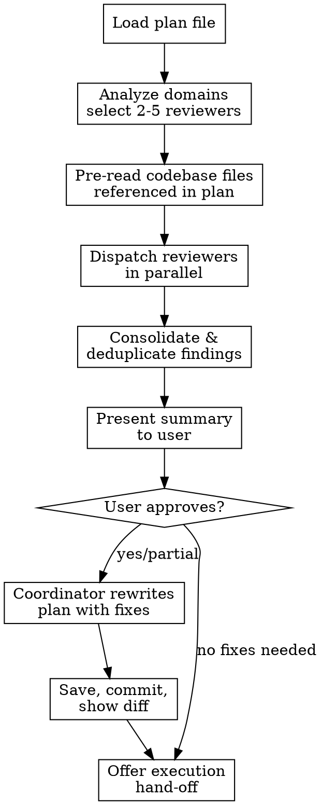

# Reviewing Plans

## Overview

This skill reviews an implementation plan before execution. It dispatches 2-5 domain-specific reviewer agents in parallel, consolidates their findings, presents a summary for approval, then applies approved fixes to the plan file.

**Announce:** "Reviewing plan: `{plan_path}` — analyzing domains to select reviewers..."

**Input:** A path to an existing plan file (markdown). If the user says "review this plan" without a path, check conversation history for the most recently written or referenced plan file.

## Non-Interactive `auto` Mode

If invoked with an `auto` (or `--auto-apply`) argument, run NON-INTERACTIVELY:
- **Step 4:** Do NOT wait for user input. Treat the selection as **"all"** — apply every finding (Critical, Important, AND Minor).
- **Step 6:** Do NOT offer an execution hand-off or ask a question. After committing the fixes, return a one-paragraph summary (counts by severity + that all were applied) and stop. The summary MUST open with the structured `REVIEWERS: X/N succeeded` line from Step 4 (append `(failed: …)` names when X < N) so a conductor can gate on review *coverage*, not just on findings — a partial reviewer failure must be machine-detectable, not absorbed silently into the findings.
- All other steps (reviewer selection, pre-read, dispatch, consolidate, apply, commit) run as normal.
This mode exists so a conductor skill (e.g. /ship) can run reviewing-plans hands-off. When the argument is absent, behavior is unchanged.

## Process Flow



## Step 1: Load and Analyze the Plan

Read the plan file. Scan its full text to detect which domains are involved. Select reviewers using this table:

| Reviewer | Condition (spawn if plan text matches ANY signal) | Always? |
|----------|--------------------------------------------------|---------|
| **General Quality** | N/A | Yes |
| **Test Quality** | N/A | Yes |
| **Supabase / RLS** | `supabase/migrations/`, `RLS`, `policy`, `auth.jwt`, `SECURITY DEFINER` | No |
| **React Patterns** | React component files, `useState`, `useEffect`, hooks, context, UI | No |
| **API / Edge Function** | `supabase/functions/`, `CORS`, edge function, `Deno.serve` | No |
| **Component Tree** | `ComponentNode`, tree traversal, BOM, nested structure | No |
| **Error Handling** | `Result<`, `Ok(`, `Err(`, `tryCatch`, error classes, OR plan uses `try/catch`/`throw` when CLAUDE.md mandates Result types | No |
| **Realtime** | realtime, subscription, websocket, channel, broadcast | No |
| **Domain Logic** | transport, distance, maritime, calculation, formula | No |
| **Codebase Alignment** | `@/` import paths, file structure, naming conventions | No |

**Rules:**
- Always spawn General Quality + Test Quality (2 minimum).
- From conditional reviewers, pick the top 3 by number of signal matches found.
- Cap at 5 total reviewers.
- Announce which reviewers were selected and why.

## Step 2: Pre-Read Codebase Context

Before dispatching reviewers, gather context they will need:

1. Parse the plan for **Files to Modify** / **Files to Create** sections (or similar headings).
2. **Fallback:** If no Files sections found, scan the plan text for file path patterns (`src/`, `supabase/`, `tests/`, etc.) and collect any paths found.
3. For each "modify" path: attempt to read the file. If it does not exist, note the missing file in a warning ("Plan references `<path>` as a modify target but it was not found — plan may be stale") and continue with the available context. Otherwise collect its contents.
4. For each "create" path: check if the file already exists (plan may be stale). Read the parent directory listing. Read one sibling file if they share a pattern (e.g., another hook or edge function in the same folder).
5. Read CLAUDE.md (project instructions) — include relevant sections. If CLAUDE.md is very large (500+ lines), extract only sections relevant to the domains detected in Step 1.
6. Bundle all collected file contents as `codebase_context` for the reviewer prompts.

This pre-reading is critical. Reviewers that lack codebase context produce vague, unhelpful findings.

## Step 3: Dispatch Reviewers in Parallel

Use the Agent tool to dispatch all selected reviewers in a **single message** (parallel execution). Each agent gets `subagent_type: "general-purpose"`.

**Reviewer prompt template** (fill in `{specialization}`, `{criteria}`, `{plan_content}`, `{codebase_context}`):

````
You are a {specialization} reviewer. Analyze the implementation plan below and report findings.

## Your Review Criteria
{criteria}

## Plan Under Review
{plan_content}

## Codebase Context (existing files)
{codebase_context}

## Instructions
- Only report genuine problems: bugs, missing edge cases, incorrect assumptions, violations of project conventions.
- Do NOT invent problems. If the plan is solid for your domain, say "No findings."
- Do NOT suggest style preferences or cosmetic changes.
- Reference actual file paths and line numbers from the codebase context when relevant.
- Do NOT read additional files or make edits. Review only.

## Output Format
Return findings as a list. If none, return "No findings."

For each finding:
- **Severity**: CRITICAL / IMPORTANT / MINOR
- **Task**: Which task number in the plan (e.g., "Task 3")
- **Location**: File path or plan section affected
- **Issue**: What is wrong (1-2 sentences)
- **Fix**: How to fix it (1-2 sentences)
````

**Criteria per reviewer type:**

| Reviewer | Criteria |
|----------|----------|
| General Quality | Missing error handling, race conditions, incomplete steps, wrong ordering, missing rollback, unclear acceptance criteria |
| Test Quality | Missing test cases, untested edge cases, missing negative tests, test file placement, mock strategy |
| Supabase / RLS | RLS policy correctness, auth.jwt() usage, migration ordering, SECURITY DEFINER risks, missing indexes |
| React Patterns | Hook rules violations, stale closures, missing deps, context misuse, unnecessary re-renders |
| API / Edge Function | CORS config, error responses, input validation, auth checks, timeout handling |
| Component Tree | Tree traversal bugs, mutation vs immutable update, recursive depth, orphan nodes |
| Error Handling | Missing Result types, swallowed errors, inconsistent error patterns, missing error classes |
| Realtime | Subscription cleanup, reconnection handling, stale data, channel naming |
| Domain Logic | Calculation correctness, unit mismatches, boundary conditions, formula errors |
| Codebase Alignment | Wrong import paths, naming convention violations, file placement, missing type exports |

## Step 4: Consolidate Findings

After all reviewers return:

1. **Reviewer failure?** Always emit a structured coverage line —
   `REVIEWERS: X/N succeeded` — as the FIRST line of the summary in EVERY case
   (full success, partial failure, total failure): N = reviewers dispatched, X =
   reviewers that returned usable output; on any failure append
   `(failed: <reviewer names>)`. This is the machine-readable signal a conductor
   (e.g. /ship) gates on — **partial failure must not be silently absorbed into the
   findings.** Then:
   - *Some but not all* reviewers failed → note it, list the failed names on the
     `REVIEWERS:` line, and proceed with the available findings. The summary still
     reports findings, but the `X/N` line tells the caller coverage was degraded —
     4 of 5 domain reviewers timing out is NOT the same as a clean review, and a
     hands-off conductor needs that distinction to block.
   - *ALL* reviewers failed (zero usable responses) → **do NOT proceed.** A 0/0/0
     findings summary here means "review did not run," not "plan is clean." In
     interactive mode, report the total failure and stop. In `auto` mode, return a
     summary marked `REVIEW FAILED — REVIEWERS: 0/{N} succeeded` (never a
     clean/no-findings summary) so the conductor treats it as a blocker.
2. **Zero findings?** If all reviewers returned "No findings," skip the summary. Say: "All {N} reviewers found no issues. Plan is ready for execution." Proceed directly to Step 6.
3. **Deduplicate**: If two reviewers flag the same issue (same task + same root cause), keep the one with higher severity and more specific fix.
4. **Sort**: CRITICAL first, then IMPORTANT, then MINOR.
5. **Present** the summary to the user:

```
## Plan Review Summary: `{plan_filename}`

**Reviewers dispatched**: {list}
**Reviewer coverage**: {X}/{N} succeeded{, failed: … when X < N}
**Findings**: {critical_count} Critical, {important_count} Important, {minor_count} Minor

### Critical
- [{task}] {one-line description} — {reviewer_name}

### Important
- [{task}] {one-line description} — {reviewer_name}

### Minor
- [{task}] {one-line description} — {reviewer_name}

**Action needed**: Say "all", "none", "only critical", "only critical and important", or reference specific findings by task number (e.g., "apply Task 3 and Task 7 findings").
```

6. **(Skip this wait entirely in `auto` mode — proceed as if the user said 'all'.)** **Wait for user input.** Do not proceed until the user says which findings to apply.

## Step 5: Apply Fixes

Once the user approves findings (all or a subset), use a single coordinator pass to rewrite the plan.

**Coordinator prompt approach** (do this yourself, not a subagent):

1. Re-read the current plan file.
2. For each approved finding, apply the fix to the plan text:
   - Add missing steps where the finding says to add them.
   - Correct wrong assumptions or file paths.
   - Add edge case handling, test cases, or migration steps as specified.
3. **Preserve** the plan's existing structure, heading hierarchy, and task numbering. Do not renumber tasks unless a task is inserted (then renumber subsequent tasks).
4. Write the updated plan to the same file path.
5. Commit with message: `docs: apply review findings to {plan_filename}`
6. Show a brief diff summary: number of sections modified, tasks added/changed.

If the user said "none" or there are zero findings, skip this step.

## Step 6: Hand Off to Execution

**(In `auto` mode, skip this section — do not ask; return the summary and stop.)**

After fixes are applied (or if no fixes were needed):

```
Plan review complete. Ready for execution?
- Option A: Execute via subagent-driven mode (I'll orchestrate task-by-task)
- Option B: Open in a parallel session for manual execution
```

If the user chooses execution, invoke the `executing-plans` skill if available.

## Common Mistakes

| Mistake | Why it's wrong | Correct approach |
|---------|---------------|-----------------|
| Spawning reviewers without codebase context | They produce vague, generic findings | Always pre-read referenced files first (Step 2) |
| Fixed roster of all reviewers every time | Wastes time, dilutes signal | Dynamically select 2-5 based on domain signals |
| Each reviewer edits the plan file | Race conditions, conflicting edits | Reviewers only report findings; coordinator applies fixes |
| Skipping user approval (interactive mode) | Unwanted changes to the plan | Always present summary and wait for explicit approval. *(Exception: `auto` mode intentionally skips approval — see Non-Interactive `auto` Mode above.)* |
| Inventing findings that aren't real issues | Wastes user trust and time | Only flag genuine bugs backed by evidence from codebase context |
| Auto-applying MINOR findings without asking (interactive mode) | User may disagree with minor suggestions | Present all findings; let user choose what to apply. *(Exception: in `auto` mode, ALL findings incl. Minor ARE applied without asking — see Non-Interactive `auto` Mode above.)* |
