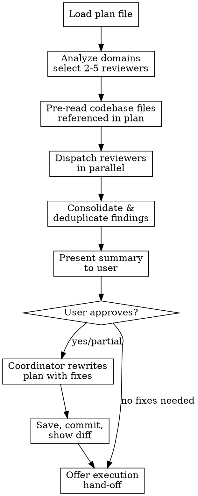

# Reviewing Plans

## Overview

This skill reviews an implementation plan before execution. It dispatches 2-5 domain-specific reviewer agents in parallel, consolidates their findings, presents a summary for approval, then applies approved fixes to the plan file.

**Announce:** "Reviewing plan: `{plan_path}` — analyzing domains to select reviewers..."

**Input:** A path to an existing plan file (markdown). If the user says "review this plan" without a path, check conversation history for the most recently written or referenced plan file.

## Non-Interactive `auto` Mode

If invoked with an `auto` (or `--auto-apply`) argument, run NON-INTERACTIVELY:
- **Step 4:** Do NOT wait for user input. Treat the selection as **"all"** — consider every finding (Critical, Important, AND Minor) for application. "All" means no human triage; it does NOT mean every finding is written. Once the Step 4a guards exist, some findings are withheld or dropped. What was actually written is reported on the `FINDINGS:` line, never inferred.
- **Step 6:** Do NOT offer an execution hand-off or ask a question. After committing the fixes, return a one-paragraph summary and stop. The summary MUST open with TWO structured lines, in this exact order — `REVIEWERS:` then `FINDINGS:` (both defined in Step 4) — so a conductor can gate on review *coverage* AND on what was actually applied. A partial reviewer failure or a guard-suppressed finding must be machine-detectable, not absorbed silently into the findings.
- All other steps (reviewer selection, pre-read, dispatch, consolidate, apply, commit) run as normal.
This mode exists so a conductor skill (e.g. /ship) can run reviewing-plans hands-off. When the argument is absent, behavior is unchanged.

### Invocation forms

- `auto <path>` — full panel, default cap of 5.
- `auto --max-reviewers N <path>` — full panel capped at N total (see Step 1 Rules).
- `auto --diff <path>` — the one-reviewer re-review below. `--max-reviewers` is ignored
  here; `--diff` fixes the panel at one.

Flags precede the path and may appear in any order.

### `auto --diff` — the one-reviewer re-review

Invoked as `auto --diff <path>`. A rescoped second pass for a conductor that has
already run a full `auto` pass and applied findings.

- Dispatches exactly **one** General Quality reviewer, on **Opus**.
- **Skips reviewer selection entirely** — no domain analysis, the reviewer is fixed.
  Step 1's "2 minimum" rule therefore does NOT apply to this mode. Do not "correct"
  the panel back to two.
- Input is the **full updated plan** + the list of findings pass 1 applied + the
  diff of those applied changes. Never the diff alone: a bare diff against a 68KB
  plan is uninterpretable. The saving comes from 5 reviewers → 1, not from
  starving the one.
- Reviewer's task: verify the applied edits did not break the plan — contradict an
  untouched section, renumber wrongly, or introduce a new gap. It is NOT a
  re-review of the original document.
- Re-use the `codebase_context` bundle from pass 1 if it is still in context;
  otherwise re-gather per Step 2. **Never dispatch it without codebase context.**
- If the conductor has lost pass 1's applied-findings list and diff to compaction,
  re-derive both from the `docs: apply review findings to <file>` commit pass 1
  produced (`git show`), rather than dispatching with empty inputs.
- Emits `REVIEWERS: 1/1 succeeded [general-quality=opus]` and a `FINDINGS:` line,
  exactly like any other run.
- It is still `auto`: it **applies** its findings, subject to the same guards, and
  commits. It does not merely report.

## Process Flow


```dot
digraph review {
  rankdir=TB; node [shape=box];
  load [label="Load plan file"];
  analyze [label="Analyze domains\nselect 2-5 reviewers"];
  preread [label="Pre-read codebase files\nreferenced in plan"];
  dispatch [label="Dispatch reviewers\nin parallel"];
  consolidate [label="Consolidate &\ndeduplicate findings"];
  present [label="Present summary\nto user"];
  approve [label="User approves?" shape=diamond];
  fix [label="Coordinator rewrites\nplan with fixes"];
  commit [label="Save, commit,\nshow diff"];
  handoff [label="Offer execution\nhand-off"];
  load -> analyze -> preread -> dispatch -> consolidate -> present -> approve;
  approve -> fix [label="yes/partial"];
  approve -> handoff [label="no fixes needed"];
  fix -> commit -> handoff;
}
```

## Step 1: Load and Analyze the Plan

Read the plan file. Scan its full text to detect which domains are involved. Select reviewers using this table:

| Reviewer | Condition (spawn if plan text matches ANY signal) | Always? |
|----------|--------------------------------------------------|---------|
| **General Quality** | N/A | Yes |
| **Test Quality** | N/A | Yes |
| **Supabase / RLS** | `supabase/migrations/`, `RLS`, `policy`, `auth.jwt`, `SECURITY DEFINER` | No |
| **React Patterns** | React component files, `useState`, `useEffect`, hooks, context, UI | No |
| **API / Edge Function** | `supabase/functions/`, `CORS`, edge function, `Deno.serve` | No |
| **Component Tree** | `ComponentNode`, tree traversal, BOM, nested structure | No |
| **Error Handling** | `Result<`, `Ok(`, `Err(`, `tryCatch`, error classes, OR plan uses `try/catch`/`throw` when CLAUDE.md mandates Result types | No |
| **Realtime** | realtime, subscription, websocket, channel, broadcast | No |
| **Domain Logic** | transport, distance, maritime, calculation, formula | No |
| **Codebase Alignment** | `@/` import paths, file structure, naming conventions | No |

**Rules:**
- Always spawn General Quality + Test Quality (2 minimum).
- From conditional reviewers, pick the top N−2 by number of signal matches found
  (default N=5, so top 3). Break ties by this table's row order, top to bottom, so
  selection is deterministic — this matters most when only one conditional slot
  exists.
- Cap at 5 total reviewers, **unless `--max-reviewers N` was passed**, which
  supersedes this cap for that invocation.
- `--max-reviewers N` caps **total** reviewers, not conditional ones. The two
  always-ons are seated first; conditional slots are N−2. **N ≥ 2 is required** —
  N < 2 is a configuration error, not a smaller panel, because it would drop an
  always-on reviewer and trip a conductor's always-on gate on every run.
- The `auto --diff` mode is exempt from all of the above: it skips selection.
- Announce which reviewers were selected and why.

## Step 2: Pre-Read Codebase Context

Before dispatching reviewers, gather context they will need:

1. Parse the plan for **Files to Modify** / **Files to Create** sections (or similar headings).
2. **Fallback:** If no Files sections found, scan the plan text for file path patterns (`src/`, `supabase/`, `tests/`, etc.) and collect any paths found.
3. For each "modify" path: attempt to read the file. If it does not exist, note the missing file in a warning ("Plan references `<path>` as a modify target but it was not found — plan may be stale") and continue with the available context. Otherwise collect its contents.
4. For each "create" path: check if the file already exists (plan may be stale). Read the parent directory listing. Read one sibling file if they share a pattern (e.g., another hook or edge function in the same folder).
5. Read CLAUDE.md (project instructions) and **always extract by domain — there is no size threshold.** A CLAUDE.md under any previous threshold still inlines dev commands, logging env vars, and service ports that no reviewer needs. Include only sections relevant to the domains detected in Step 1, **plus every item on the always-include list below whenever the plan touches backend files**:

   - the import convention (full module paths)
   - *Report state is product-level* (#1105)
   - *LCA compile state is product-level* (#1104)
   - tier-gated LCI source selection
   - the DQ audit trail and DQ score notes

   These are invariants whose omission causes a silently wrong review, so domain
   relevance does not gate them.

   **Staleness owner:** this list is a snapshot of CLAUDE.md as of 2026-09-01.
   Whoever adds a new invariant section to CLAUDE.md updates this list in the same
   change. An unmaintained list degrades review quality invisibly, which is the one
   failure mode this extraction must not introduce.

   **Report what was included.** Name the extracted sections in the run summary, so
   a conductor can log them. An extraction that silently dropped an invariant must
   not look identical to one that kept it.
6. Bundle all collected file contents as `codebase_context` for the reviewer prompts.

This pre-reading is critical. Reviewers that lack codebase context produce vague, unhelpful findings.

## Step 3: Dispatch Reviewers in Parallel

Use the Agent tool to dispatch all selected reviewers in a **single message** (parallel execution). Each agent gets `subagent_type: "general-purpose"` and an explicit `model` override:

| Model | Reviewers |
|-------|-----------|
| **Opus** (`model: "opus"`) | General Quality, Supabase / RLS, Domain Logic, and the `auto --diff` re-reviewer |
| **Sonnet** (`model: "sonnet"`) | Test Quality, Error Handling, API / Edge Function, React Patterns, Realtime, Component Tree, Codebase Alignment |
| **Haiku** | none — excluded entirely |

General Quality stays on Opus because it is the cross-cutting floor under every
domain. Supabase/RLS stays because a missed grant or policy is what a conductor's
production DB rail would otherwise have to catch *after* the write reached prod.
Domain Logic stays because this codebase's bug history is unit and formula bugs.
Haiku is excluded because auto-apply amplifies false positives, and its invention
rate is not worth the marginal saving even on mechanical reviewers.

Record each reviewer's model in the `REVIEWERS:` line's bracket. Without it the
assignment is unobservable: a silently-ignored override would leave every reviewer
on Opus with no signal, and guard (b) — which is *defined by* reviewer model —
would withhold nothing while still reporting `withheld_minor=0`.

**Reviewer prompt template** (fill in `{specialization}`, `{criteria}`, `{plan_content}`, `{codebase_context}`):

````
You are a {specialization} reviewer. Analyze the implementation plan below and report findings.

## Your Review Criteria
{criteria}

## Plan Under Review
{plan_content}

## Codebase Context (existing files)
{codebase_context}

## Instructions
- Only report genuine problems: bugs, missing edge cases, incorrect assumptions, violations of project conventions.
- Do NOT invent problems. If the plan is solid for your domain, say "No findings."
- Do NOT suggest style preferences or cosmetic changes.
- Reference actual file paths and line numbers from the codebase context when relevant.
- Do NOT read additional files or make edits. Review only.

## Output Format
Return findings as a list. If none, return "No findings."

For each finding:
- **Severity**: CRITICAL / IMPORTANT / MINOR
- **Task**: Which task number in the plan (e.g., "Task 3")
- **Location**: File path or plan section affected
- **Issue**: What is wrong (1-2 sentences)
- **Evidence**: REQUIRED. A `file:line` reference from the codebase context above, or
  a verbatim plan section heading. A finding with no citation here is dropped during
  consolidation (CRITICALs are downgraded, not dropped). Do not cite a file you were
  not given.
- **Fix**: How to fix it (1-2 sentences)
````

**Criteria per reviewer type:**

| Reviewer | Criteria |
|----------|----------|
| General Quality | Missing error handling, race conditions, incomplete steps, wrong ordering, missing rollback, unclear acceptance criteria |
| Test Quality | Missing test cases, untested edge cases, missing negative tests, test file placement, mock strategy |
| Supabase / RLS | RLS policy correctness, auth.jwt() usage, migration ordering, SECURITY DEFINER risks, missing indexes |
| React Patterns | Hook rules violations, stale closures, missing deps, context misuse, unnecessary re-renders |
| API / Edge Function | CORS config, error responses, input validation, auth checks, timeout handling |
| Component Tree | Tree traversal bugs, mutation vs immutable update, recursive depth, orphan nodes |
| Error Handling | Missing Result types, swallowed errors, inconsistent error patterns, missing error classes |
| Realtime | Subscription cleanup, reconnection handling, stale data, channel naming |
| Domain Logic | Calculation correctness, unit mismatches, boundary conditions, formula errors |
| Codebase Alignment | Wrong import paths, naming convention violations, file placement, missing type exports |

## Step 4: Consolidate Findings

After all reviewers return:

1. **Reviewer failure?** Always emit TWO structured lines — `REVIEWERS:` then
   `FINDINGS:` — as the FIRST two lines of the summary in EVERY case
   (full success, partial failure, total failure): N = reviewers dispatched, X =
   reviewers that returned usable output; on any failure append
   `(failed: <reviewer names>)`. This is the machine-readable signal a conductor
   (e.g. /ship) gates on — **partial failure must not be silently absorbed into the
   findings.** Then:
   - *Some but not all* reviewers failed → note it, list the failed names on the
     `REVIEWERS:` line, and proceed with the available findings. The summary still
     reports findings, but the `X/N` line tells the caller coverage was degraded —
     4 of 5 domain reviewers timing out is NOT the same as a clean review, and a
     hands-off conductor needs that distinction to block.
   - *ALL* reviewers failed (zero usable responses) → **do NOT proceed.** A 0/0/0
     findings summary here means "review did not run," not "plan is clean." In
     interactive mode, report the total failure and stop. In `auto` mode, return a
     summary marked `REVIEW FAILED — REVIEWERS: 0/{N} succeeded` (never a
     clean/no-findings summary) so the conductor treats it as a blocker.

   **The two lines, in full:**

   ```
   REVIEWERS: 2/3 succeeded (failed: React Patterns) [general-quality=opus test-quality=sonnet react-patterns=sonnet]
   FINDINGS: reported C=2 I=5 M=3 | applied C=1 I=5 M=1 | withheld_minor=2 | dropped_unevidenced=1 | downgraded_critical=1
   ```

   - `REVIEWERS:` — `X/N succeeded`, then `(failed: …)` when X < N, then a bracket
     listing **every dispatched reviewer** and the model it ran on. Names are the
     lowercase-hyphenated Step 1 table names. The bracket lists dispatched, not
     succeeding, reviewers: a conductor's panel rules need to know a conditional
     reviewer was sent at all.
   - `FINDINGS:` — five fields:

     | Field | Meaning |
     |-------|---------|
     | `reported` | findings returned by reviewers, after dedup, before any guard |
     | `applied` | findings actually written into the plan file, at post-downgrade severity |
     | `withheld_minor` | MINOR findings from non-Opus reviewers, reported but not applied |
     | `dropped_unevidenced` | findings dropped for lacking an `Evidence:` citation |
     | `downgraded_critical` | unevidenced CRITICALs downgraded to IMPORTANT rather than dropped |

   **Until the Step 4a guards exist, the last three fields are always `0`.** Emit
   them anyway — the contract must be in place before anything can make a finding
   vanish, or the summary would silently overstate what landed.

   **Conservation — two identities and one constraint.** A line violating any of
   them is malformed, and a conductor treats it as unparseable:

   ```
   unresolved_critical = reported_C − applied_C − downgraded_critical
   applied_total       = reported_total − withheld_minor − dropped_unevidenced − unresolved_critical
   constraint:  unresolved_critical ≥ 0     (a CRITICAL is never counted in dropped_unevidenced)
   ```

   Do NOT restate the first as `applied_C = reported_C − downgraded_critical`. As a
   *validity* rule that form forces `unresolved_critical` to zero on every conforming
   line, making the consumer's block unreachable — the one shape that should block
   becomes the one shape declared invalid.

   On total reviewer failure emit `FINDINGS:` with all-zero counts. That line is
   byte-identical to a clean review's, which is safe only because `REVIEWERS: 0/N`
   is what distinguishes them and the conductor reads it first.
2. **Zero findings?** If all reviewers returned "No findings," still emit BOTH
   structured lines FIRST — `REVIEWERS: {X}/{N} succeeded{ (failed: …) when X < N} [{reviewer}={model} …]`
   and `FINDINGS: reported C=0 I=0 M=0 | applied C=0 I=0 M=0 | withheld_minor=0 |
   dropped_unevidenced=0 | downgraded_critical=0` — then say: "All {N} reviewers
   found no issues. Plan is ready for execution." Proceed directly to Step 6.

   Keep the full `REVIEWERS:` form here, `(failed: …)` suffix included. Zero findings
   and a partial reviewer failure can co-occur, and a conductor's always-on and
   panel-size rules parse the failed names from this exact line.

   **Do not skip the `FINDINGS:` line here because the counts are all zero.** This
   branch returns early and never reaches the point 5 template, so it is the one
   place the line is easiest to forget — and it is also the most common outcome. A
   conductor that receives no `FINDINGS:` line must assume the worst and re-review,
   so omitting it on the clean path would make the cheapest case behave like the
   most expensive one.
3. **Deduplicate**: If two reviewers flag the same issue (same task + same root cause), keep the one with higher severity and more specific fix.
3a. **Apply the guards (Step 4a).** Run these after dedup and before sorting. They
   are what make `reported` and `applied` differ, and their counts go on the
   `FINDINGS:` line.

   **Guard (a) — evidence filter.** Drop any finding whose `Evidence:` field is
   missing, empty, or does not name a file from `codebase_context` or a heading that
   appears verbatim in the plan. Count each in `dropped_unevidenced`. This applies to
   Opus reviewers too — it improves their precision as well.

   **A CRITICAL is never dropped.** An unevidenced CRITICAL is *downgraded to
   IMPORTANT and applied*, counted in `downgraded_critical`, and its verbatim text is
   included in the summary. Silently discarding the highest-severity findings is the
   one failure these guards must not introduce: a dropped CRITICAL would take the
   conductor's unresolved-CRITICAL blocker with it, turning the strongest safety gate
   into a no-op that nothing reports. Guard (a) exists to keep noise out of the plan
   file, not to suppress alarms.

   **Guard (b) — no auto-apply of non-Opus MINOR.** A MINOR finding from a Sonnet
   reviewer is reported in the summary but never written to the plan. Count each in
   `withheld_minor`. MINOR findings from Opus reviewers ARE applied.

   Both guards leave `reported` untouched — it is the pre-guard count by definition.

4. **Sort**: CRITICAL first, then IMPORTANT, then MINOR.
5. **Present** the summary to the user:

```
REVIEWERS: {X}/{N} succeeded{ (failed: …) when X < N} [{reviewer}={model} …]
FINDINGS: reported C={c} I={i} M={m} | applied C={ac} I={ai} M={am} | withheld_minor={w} | dropped_unevidenced={d} | downgraded_critical={dc}

## Plan Review Summary: `{plan_filename}`

**Reviewers dispatched**: {list}
**Findings**: {critical_count} Critical, {important_count} Important, {minor_count} Minor

### Critical
- [{task}] {one-line description} — {reviewer_name}

### Important
- [{task}] {one-line description} — {reviewer_name}

### Minor
- [{task}] {one-line description} — {reviewer_name}

**Action needed**: Say "all", "none", "only critical", "only critical and important", or reference specific findings by task number (e.g., "apply Task 3 and Task 7 findings").
```

6. **(Skip this wait entirely in `auto` mode — proceed as if the user said 'all', subject to the Step 4a guards.)** **Wait for user input.** Do not proceed until the user says which findings to apply.

## Step 5: Apply Fixes

Once the user approves findings (all or a subset), use a single coordinator pass to rewrite the plan.

**Coordinator prompt approach** (do this yourself, not a subagent):

1. Re-read the current plan file.
2. For each approved finding, apply the fix to the plan text:
   - Add missing steps where the finding says to add them.
   - Correct wrong assumptions or file paths.
   - Add edge case handling, test cases, or migration steps as specified.
3. **Preserve** the plan's existing structure, heading hierarchy, and task numbering. Do not renumber tasks unless a task is inserted (then renumber subsequent tasks).
4. Write the updated plan to the same file path.
5. Commit with message: `docs: apply review findings to {plan_filename}`
6. Show a brief diff summary: number of sections modified, tasks added/changed.

If the user said "none", if there are zero findings, **or if zero findings were
actually applied**, skip this step. The last case is new and reachable: the Step 4a
guards can withhold or drop every finding, leaving the plan file unchanged. Running
the commit anyway fails with "nothing to commit", which surfaces to a conductor as a
phase command failure rather than the clean no-op it is.

## Step 6: Hand Off to Execution

**(In `auto` mode, skip this section — do not ask; return the summary and stop.)**

After fixes are applied (or if no fixes were needed):

```
Plan review complete. Ready for execution?
- Option A: Execute via subagent-driven mode (I'll orchestrate task-by-task)
- Option B: Open in a parallel session for manual execution
```

If the user chooses execution, invoke the `executing-plans` skill if available.

## Common Mistakes

| Mistake | Why it's wrong | Correct approach |
|---------|---------------|-----------------|
| Spawning reviewers without codebase context | They produce vague, generic findings | Always pre-read referenced files first (Step 2) |
| Fixed roster of all reviewers every time | Wastes time, dilutes signal | Dynamically select 2-5 based on domain signals |
| Each reviewer edits the plan file | Race conditions, conflicting edits | Reviewers only report findings; coordinator applies fixes |
| Skipping user approval (interactive mode) | Unwanted changes to the plan | Always present summary and wait for explicit approval. *(Exception: `auto` mode intentionally skips approval — see Non-Interactive `auto` Mode above.)* |
| Inventing findings that aren't real issues | Wastes user trust and time | Only flag genuine bugs backed by evidence from codebase context |
| Auto-applying MINOR findings without asking (interactive mode) | User may disagree with minor suggestions | Present all findings; let user choose what to apply. *(Exception: in `auto` mode, findings incl. Minor are applied without asking, subject to the Step 4a guards — see Non-Interactive `auto` Mode above. The `FINDINGS:` line reports what actually landed.)* |
